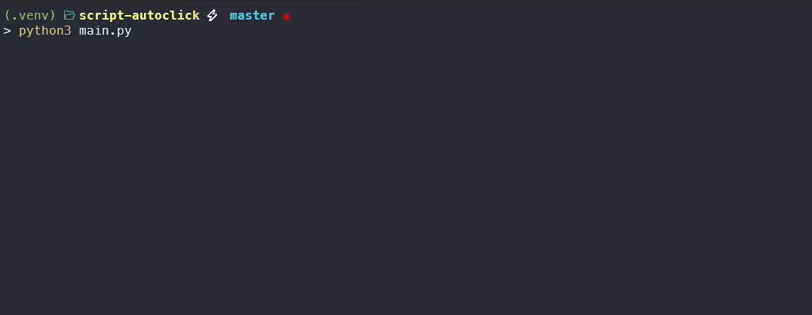

## **AUTOCLICK SCRIPT**


#### Installation

```git
git clone https://github.com/arkeasz/script-autoclick.git
```
***Use the package manager to install the packages***

```bash
pip install -r requirements.txt
```

* (recommended but not mandatory) open the virtual enviroment

**Active the virtualenv**

```sh
python -m venv .venv
```

* windows (powershell)
```powershell
.\.venv\bin\activate
```

* linux (bash)
```bash
. ./.venv/scripts/activate
```
* Nushell
```bash
source ./.venv/scripts/activate.nu
```

* Finally use the script
```bash
python main.py
```

#### **Use**
Press the key:

**R** -> For activate the clicks of the button left of the mouse or desactivate the clicks

**X** -> Finish the script
